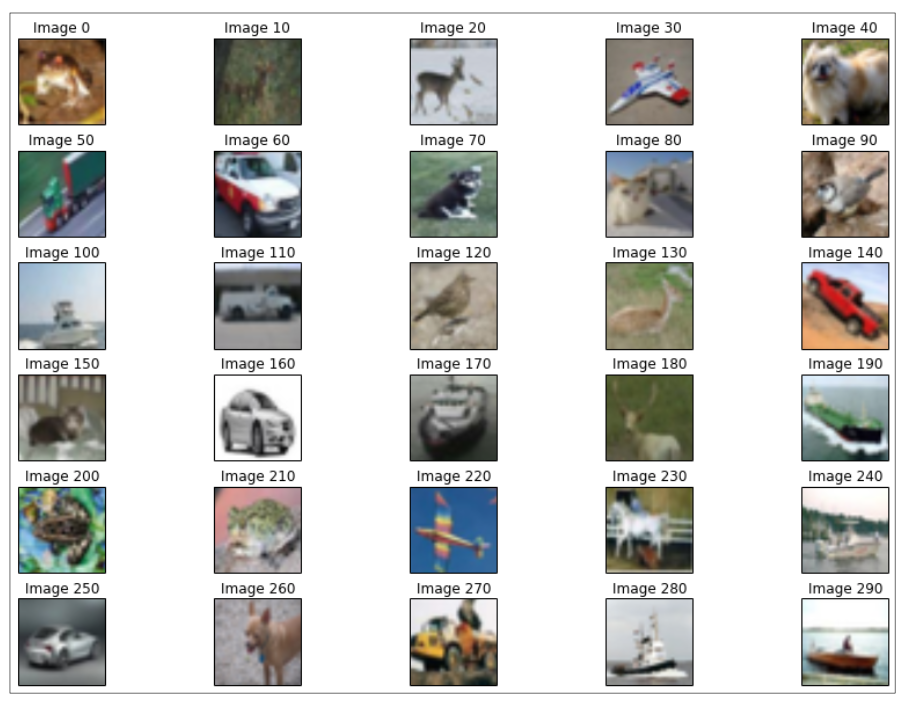

<h2> Project 1: Image Classification with Deep Learning </h2>
We will look at determining what object is represented in an image. The pixel values will be used as input, and the neural network will then automatically  nd useful combinations of pixels to form higher-level features. 

We will take on the role of a vision system for a car, looking around at any obstacles in the way or on the side of the road. Images are of the following form from the CIFAR 10 dataset:

    

Overall, in this project,

we will examine the following:

    - Classifying objects in images
    - The different types of deep neural networks
    - Theano, Lasagne, and nolearn; libraries to build and train neural networks
    - Using a GPU to improve the speed of the algorithms

<h2>Project 2: Product Recommendation with Affinity Analysis</h2>
===
We have transactions where the objects of interest (movies, in this case) are used within those transactions in some way. The aim is to discover when objects occur simultaneously. In this example, we wish to work out when two movies are recommended by the same reviewers.

Dataset used here is from Grouplens, a research group at the University of Minnesota. 

The key concepts are as follows:

	- Affinity analysis
	- Feature association mining using the Apriori algorithm
	- Movie recommendations
	- Sparse data formats

And it can be applied to 

	- Fraud detection
	- Customer segmentation
	- Software optimization
	- Product recommendations
